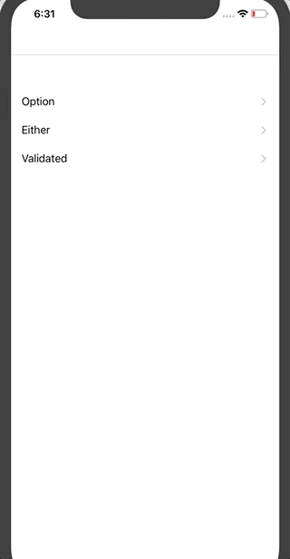
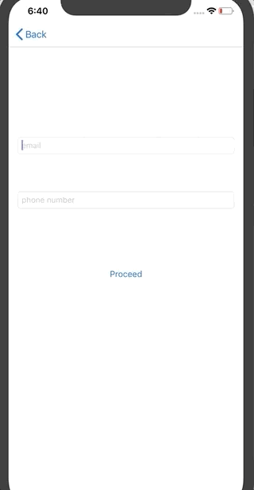

# Functional Validation With Bow

This repository consists in the implementation of some examples that show how to use functional data types to perform validation of two fields in Swift.
The fields we want to validate are an **email** field and a **phone number** field.

To reach my goal I used Bow (https://github.com/bow-swift/bow), a framework that provides useful things to do functional programming in swift.

Thanks to [Daniele Campogiani](https://github.com/dcampogiani) for the support and the inspiration that gave me. This repository is based to Daniele Campogiani's Android Functional Validation repo (https://github.com/dcampogiani/AndroidFunctionalValidation).

# Installation

Open the project with XCode 11 and run it.

# Functional Data Types

The examples in code show how to perform validation with **Option**, **Either** and **Validated** data types.

## Validation with Option

Option Data Type provides two possible values:

* **none( )**: the case in which our field is not valid
* **some(_:)**: the case in which out field is valid, encapsulating the valid value.

## Validation with Either

Either Data Type provides two possible values:

* **left(_:)**: generally, the case in which our field is not valid, encapsulating the information relative to the error that occurred. 
* **right(_:)**: the case in which out field is valid, encapsulating the valid value.

## Validation with Validated

Validated Data Type provides two possible values:

* **invalid(_:)**: the case in which our field is not valid, encapsulating the information relative to the error that occurred. 
* **valid(_:)**: the case in which out field is valid, encapsulating the valid value.

The main difference between **Validated** and **Either** is that **Validated** gives me the possibility to aggregate multiple errors in an Array of errors, so that I can use them to present multiple errors in once.
